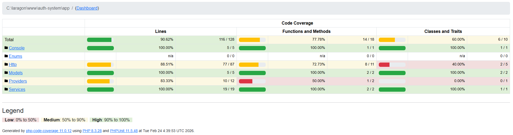

#  Laravel JWT Authentication API

Hệ thống RESTful API cung cấp giải pháp xác thực bảo mật sử dụng **JSON Web Token (JWT)**. Dự án tập trung vào kiến trúc Backend, bảo mật, và khả năng mở rộng.

##  Tính Năng Chính

* **JWT Authentication:** Đăng nhập/Đăng ký không trạng thái (Stateless).
* **Secure Refresh Token:** Cơ chế cấp lại Token mới khi Token cũ hết hạn (TTL mặc định: 60 phút) giúp duy trì phiên làm việc an toàn.
* **Role-Based Access Control:** Middleware phân quyền (Admin/User).
* **Standardized Responses:** Cấu trúc JSON trả về đồng nhất.

##  Công Nghệ

* **Core:** PHP 8.3, Laravel 12
* **Security:** tymon/jwt-auth
* **Database:** MySQL

##  Cài Đặt (Installation)

1.  **Clone dự án:**
    ```bash
    git clone https://github.com/quaminhNG/auth-service-laravel.git
    cd <project_dir>
    ```

2.  **Cài đặt Dependencies & Môi trường:**
    ```bash
    composer install
    cp .env.example .env
    php artisan key:generate
    php artisan jwt:secret
    ```

3.  **Cấu hình Database & Khởi chạy:**
    * Tạo database trong MySQL.
    * Cập nhật thông tin DB trong file `.env`.
    * Chạy migration và seeder:
    ```bash
    php artisan migrate --seed
    ```

4.  **Chạy Server:**
    ```bash
    php artisan serve
    ```

##  API Documentation (Endpoints)

Base URL: `http://127.0.0.1:8000/api/auth`

| Method | Endpoint    | Mô tả                        | Auth Header?      |
| :----- | :---------- | :--------------------------- | :---------------- |
| POST   | `/register` | Đăng ký tài khoản mới        | No                |
| POST   | `/login`    | Đăng nhập (Nhận Token)       | No                |
| POST   | `/me`       | Lấy thông tin User hiện tại  | **Yes** (Bearer)  |
| POST   | `/refresh`  | Gia hạn Token mới            | **Yes** (Bearer)  |
| POST   | `/logout`   | Đăng xuất (Hủy Token)        | **Yes** (Bearer)  |

### Tài khoản Demo (Seeder)
* **Email:** `admin@example.com`
* **Password:** `password123`

---

##  Kết Quả Kiểm Thử (Testing)

Hệ thống được phát triển với độ bao phủ test case đầy đủ cho các luồng xác thực cốt lõi bằng PHPUnit. Dưới đây là thông số pass rate mới nhất (`php artisan test`):

```text
   PASS  Tests\Feature\AuthTest
  ✓ user can register
  ✓ user can login
  ✓ user cannot access with wrong role
  ✓ rate limiting on login
  ✓ user can refresh token
  ✓ user can logout
  ✓ admin can access dashboard

  Tests:    10 passed (32 assertions)
  Duration: 2.15s
```


---
**Author:** Minh Qua (rick)
